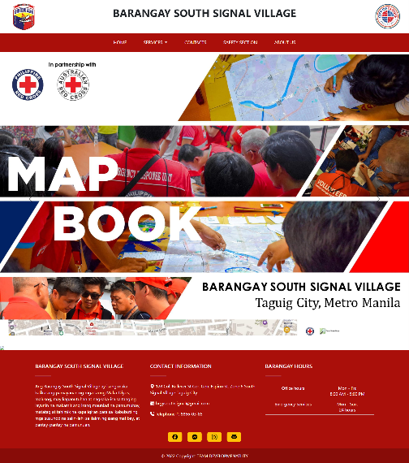
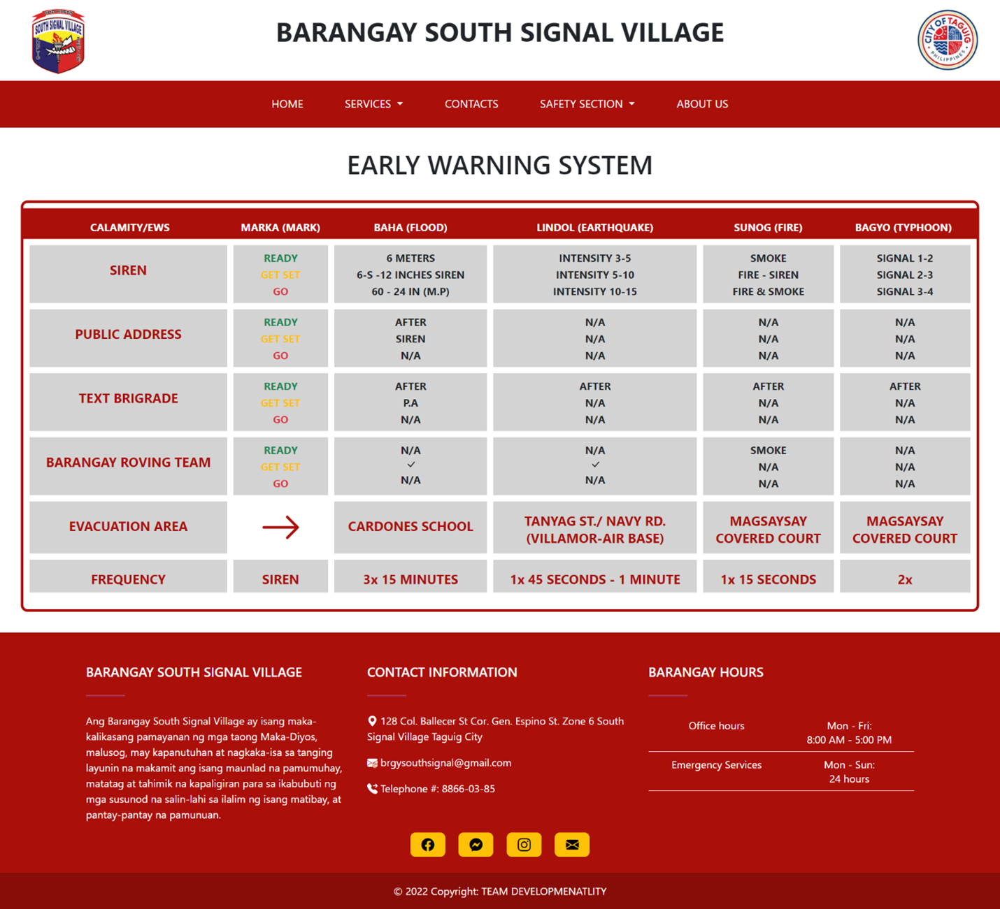
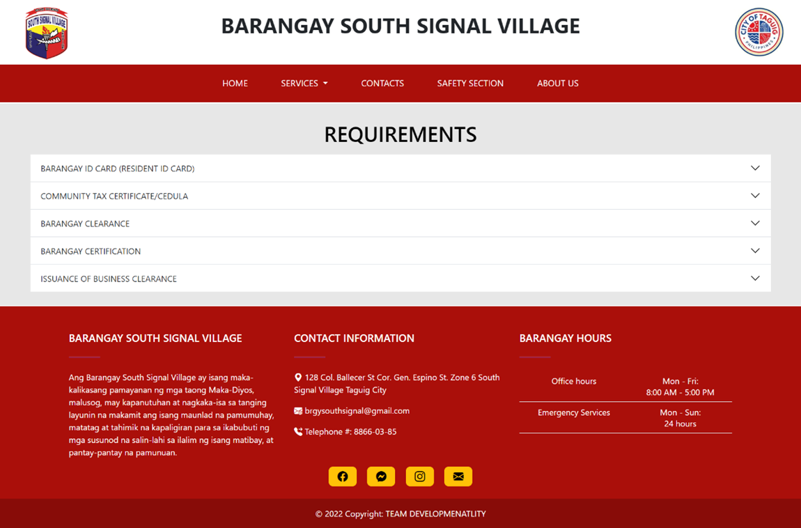
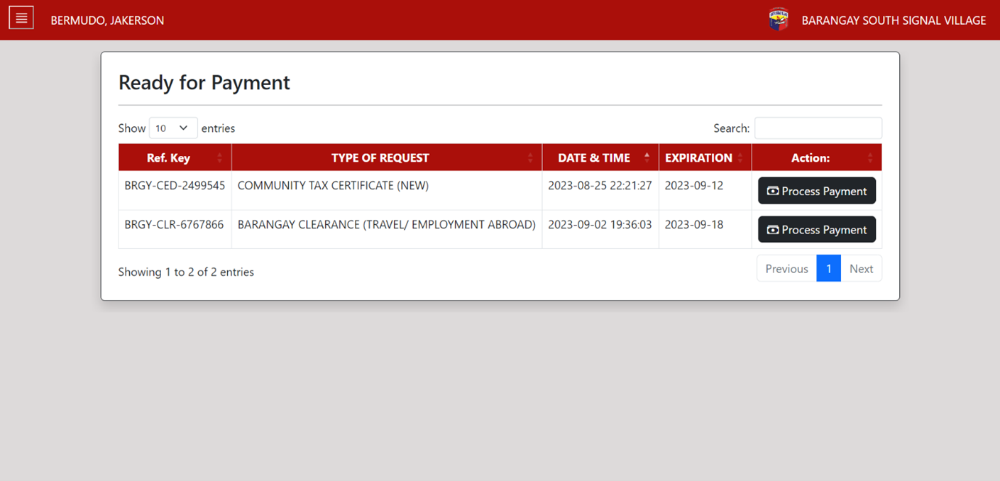

# 📘 Laravel Project - Project Name
## 📖 Description
This project is a centralized web application developed for Barangay South Signal Village to modernize and streamline their document request process. The current manual system involves paper-based forms, in-person submissions, and logbook record-keeping, which can be time-consuming and inefficient. Our proposed web app provides residents with an easier, faster way to request barangay documents online, reducing manual workload and improving overall service delivery through real-time processing, digital records, and automated workflows.

## 🚀 Features

- 📄 **Landing Page**
    
    - 🏘️ **About Us**  
      Contains detailed information about Barangay South Signal Village, including the barangay profile, history, mission, vision, demography, and the organizational chart of the barangay officials.

    - 🛡️ **Safety Section**  
      Displays safety guidelines and the Map Book of the barangay (provided by the Philippine Red Cross), which includes:
        - Base map
        - Capacity map
        - Vulnerability map
        - Land use map
        - Historical hazard map
        - Flood hazard map  
      

      - This section also outlines safety protocols in case of calamities, covering the Early Warning System (EWS), such as:
        - Siren warnings
        - Public address systems
        - Text brigades
        - Barangay Roving Team
        - Designated evacuation areas

    - 📞 **Contacts**  
      Displays contact information, including:
        - Barangay hotlines
        - Emergency hotline
        - Embedded Google Map for tracking the Barangay South Signal Village Office

    - 📃 **Required Guidelines**  
      Lists all available documents that can be requested, with:
        - Cost per document
        - Manual request instructions
        - Estimated processing time
        - Required documents

- 👥 **Resident Dashboard**
  
    - 📬 **Online Request**  
      Registered residents can request barangay documents online. After submitting a request, the system sends an email notification with a tracking key.
      
    - 📝 **Submitting a Concern**  
      Residents can inquire or report problems or incidents within the barangay.

    - 🔍 **Track a Request**  
      Allows residents to monitor the status of their document requests and concerns using their tracking key.

    - 📑 **Transaction History**  
      Displays all transactions made through the resident’s barangay account.

    - 💳 **Online Payment**  
      Residents can pay for requested documents via e-wallets such as GrabPay, Maya, and GCash — no longer limited to PayMongo.
      
      

- 🧑‍💼 **Barangay Employee Dashboard**
    - Process online requests and concerns submitted by residents
    - View and confirm online payments
    - Manage barangay employee and resident accounts
    - Generate reports
    - Oversee the entire web application system
 
      

- 🆔 **ID Analyzer**  
  During registration, residents upload the front and back of their valid ID and a face photo. An Identity Verification API is used to:
    - Validate the ID’s authenticity
    - Match the face to the ID
    - Extract and verify data such as address, age, and expiration date  
  Verified users can then proceed with registration.

- 🔐 **Security**
    - Google reCAPTCHA integration to protect against bots and spam

## 🛠️ Technical Background

- 🎨 The wireframe for the web-based application will be designed using **Figma** .
- 💻 For the **frontend**:
  - **HTML** 
  - **CSS** 
  - **JavaScript (JS)**   
  These technologies will support the development of a responsive and user-friendly UI/UX design.
- 🖥️ For the **backend**:
  - **Laravel** , a robust PHP framework
  - **MySQL**  as the relational database system


## 👤 User Roles

| Role                     | Description |
|--------------------------|-------------|
| 🧑‍🤝‍🧑 **Resident**         | - Primary user of the web app. <br> - Can access and avail services provided by the application. |
| 🛡️ **Administrator**      | - Has the highest level of control over the web app. <br> - Assigns roles to barangay employees. <br> - Manages the entire web application. |
| 🗂️ **Barangay Secretary** | - Handles and processes resident requests and concerns. <br> - Verifies submitted requirements. |
| 🧑‍⚖️ **Barangay Captain**  | - Can view generated reports from the web app. |
| 💰 **Barangay Treasurer** | - Confirms resident payments (online and onsite). <br> - Verifies online transactions. |
| 📢 **Barangay Concern Manager** | - Manages and resolves concerns submitted by residents. |
| 📄 **Barangay Request Manager** | - Handles and processes document or service requests made by residents. |

## 📦 Installation  
```bash
# 1. Clone the repository
git clone https://github.com/your-username/your-laravel-project.git
cd your-laravel-project

# 2. Install PHP dependencies
composer install

# 3. Create .env file
cp .env.example .env

# 4. Generate application key
php artisan key:generate

# 5. Configure your database in .env

# 6. Run migrations and seeders
php artisan migrate --seed

# 7. Install and compile frontend dependencies (optional)
npm install
npm run dev

# 8. Serve the application
php artisan serve
```
## 👥 Team Members

| Full Name              | Email                               | Role(s)                                                |
|------------------------|-------------------------------------|--------------------------------------------------------|
| Jakerson Bermudo       | jbbermudo@student.apc.edu.ph        | Full-stack Developer, Scrum Master                     |
| Wilkins Caducio        | wvcaducio@student.apc.edu.ph        | Product Owner, Front-end Developer, Scrum Member       |
| Mikedale Dellera       | mbdellera@student.apc.edu.ph        | Back-end Developer, Scrum Member                       |
| Rark Mowen Alcantara   | rlalcantara@student.apc.edu.ph      | Front-end Developer, Scrum Member                      |
| Princess Joy Ferrer    | phferrer@student.apc.edu.ph         | Back-end Developer, Scrum Member                       |
| Carl James Garcia      | cagarcia@student.apc.edu.ph         | Back-end Developer, Scrum Member                       |


## 📂 Links

- **Demo:** [Demo Video](Documentation/demo.mp4)
- **Documentation:** [Documentation Paper](Documentation/TEAM%20DEVELOPMENTALITY%20-%20PAPER%20-%20AFTER%20PROOFREADING.docx)


## 📩 Contact

If you would like to access or use any of the above resources, please contact me at:  
[jakersonbermudo98@gmail.com](mailto:jakersonbermudo98@gmail.com)  

**Note:** Do not use any of the above resources without prior consent.
